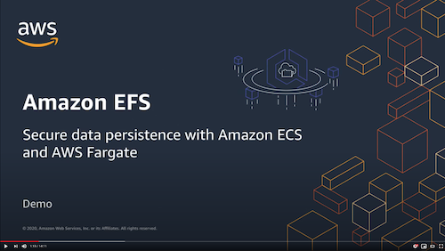

## Amazon EFS Integrations

This repository provides examples of some of the various Amazon EFS integrations available, beginning with ECS on EC2 and ECS on AWS Fargate.

## Usage

1. Install the [Amazon Cloud Development Kit](https://aws.amazon.com/cdk/) (CDK).
2. Clone this repository and `cd` into it.
3. Modify the arguments to the `AmazonEfsIntegrationsStack` constructor in `$/bin/cdk.ts` according to your environment.
    * The default settings will get you to the environment state at the beginning of the demo video linked below. The demo scenario has two running ECS services, but no EFS file system.
    * Alternatively, if you'd like to deploy the full setup, you can set all of the `createXXXXX` arguments to `true`.
4. Execute the following:
    * `npm install`
    * `npm run cdk bootstrap`
    * `npm run cdk deploy`
5. Visit the load balancer URLs and explore the AWS console within the ECS and EFS services to see how everything works, or follow along in the demo video to build the rest of the solution yourself.

## Cleanup

Execute `npm run cdk destroy` to delete resources pertaining to this example.

You will also need to delete the following *manually*:
   * The [CDKToolkit CloudFormation Stack](https://console.aws.amazon.com/cloudformation/home#/stacks?filteringText=CDKToolkit) created by `npm run cdk bootstrap`.
   * The `cdktoolkit-stagingbucket-<...>` bucket.

## Demo

[](https://www.youtube.com/watch?v=FJlHXBcDJiw)

## Example EFS file system policy

If you're looking the example of the EFS file system policy mentioned in the demo video to use as a reference, it can be found below. Please note the values enclosed `<WITHIN_ANGLE_BRACKETS>`, which would need to be modified to suit your particular deployment.

```json
{
    "Version": "2012-10-17",
    "Statement": [
        {
            "Sid": "DisableRootAccessAndEnforceReadOnlyByDefault",
            "Effect": "Allow",
            "Principal": {
                "AWS": "*"
            },
            "Action": "elasticfilesystem:ClientMount",
            "Resource": "arn:aws:elasticfilesystem:${AWS::Region}:${AWS::AccountId}:file-system/<EFS_FILESYSTEM_ID>",
        },
        {
            "Sid": "EnforceInTransitEncryption",
            "Effect": "Deny",
            "Principal": {
                "AWS": "*"
            },
            "Action": "*",
            "Resource": "arn:aws:elasticfilesystem:${AWS::Region}:${AWS::AccountId}:file-system/<EFS_FILESYSTEM_ID>",
            "Condition": {
                "Bool": {
                    "aws:SecureTransport": "false"
                }
            }
        },
        {
            "Sid": "EcsOnEc2CloudCmdTaskReadWriteAccess",
            "Effect": "Allow",
            "Principal": {
                "AWS": "arn:aws:iam::${AWS::AccountId}:role/<ECS_ON_EC2_TASK_ROLE>"
            },
            "Action": [
                "elasticfilesystem:ClientMount",
                "elasticfilesystem:ClientWrite"
            ],
            "Resource": "arn:aws:elasticfilesystem:${AWS::Region}:${AWS::AccountId}:file-system/<EFS_FILESYSTEM_ID>",
            "Condition": {
                "StringEquals": {
                    "elasticfilesystem:AccessPointArn": [
                        "arn:aws:elasticfilesystem:${AWS::Region}:${AWS::AccountId}:access-point/<COMMON_AP_ID>",
                        "arn:aws:elasticfilesystem:${AWS::Region}:${AWS::AccountId}:access-point/<ECS_PRIVATE_AP_ID>",
                        "arn:aws:elasticfilesystem:${AWS::Region}:${AWS::AccountId}:access-point/<ECS_SHARED_AP_ID>"
                    ]
                }
            }
        },
        {
            "Sid": "EcsOnEc2CloudCmdTaskReadAccess",
            "Effect": "Allow",
            "Principal": {
                "AWS": "arn:aws:iam::${AWS::AccountId}:role/<ECS_ON_EC2_TASK_ROLE>"
            },
            "Action": "elasticfilesystem:ClientMount",
            "Resource": "arn:aws:elasticfilesystem:${AWS::Region}:${AWS::AccountId}:file-system/<EFS_FILESYSTEM_ID>",
            "Condition": {
                "StringEquals": {
                    "elasticfilesystem:AccessPointArn": "arn:aws:elasticfilesystem:${AWS::Region}:${AWS::AccountId}:access-point/<FARGATE_SHARED_AP_ID>"
                }
            }
        },
        {
            "Sid": "EcsOnFargateCloudCmdTaskReadWriteAccess",
            "Effect": "Allow",
            "Principal": {
                "AWS": "arn:aws:iam::${AWS::AccountId}:role/<ECS_ON_FARGATE_TASK_ROLE>"
            },
            "Action": [
                "elasticfilesystem:ClientMount",
                "elasticfilesystem:ClientWrite"
            ],
            "Resource": "arn:aws:elasticfilesystem:${AWS::Region}:${AWS::AccountId}:file-system/<EFS_FILESYSTEM_ID>",
            "Condition": {
                "StringEquals": {
                    "elasticfilesystem:AccessPointArn": [
                        "arn:aws:elasticfilesystem:${AWS::Region}:${AWS::AccountId}:access-point/<COMMON_AP_ID>",
                        "arn:aws:elasticfilesystem:${AWS::Region}:${AWS::AccountId}:access-point/<FARGATE_PRIVATE_AP_ID>",
                        "arn:aws:elasticfilesystem:${AWS::Region}:${AWS::AccountId}:access-point/<FARGATE_SHARED_AP_ID>"
                    ]
                }
            }
        },
        {
            "Sid": "EcsOnFargateCloudCmdTaskReadAccess",
            "Effect": "Allow",
            "Principal": {
                "AWS": "arn:aws:iam::${AWS::AccountId}:role/<ECS_ON_FARGATE_TASK_ROLE>"
            },
            "Action": "elasticfilesystem:ClientMount",
            "Resource": "arn:aws:elasticfilesystem:${AWS::Region}:${AWS::AccountId}:file-system/<EFS_FILESYSTEM_ID>",
            "Condition": {
                "StringEquals": {
                    "elasticfilesystem:AccessPointArn": "arn:aws:elasticfilesystem:${AWS::Region}:${AWS::AccountId}:access-point/<ECS_SHARED_AP_ID>"
                }
            }
        }
    ]
}
```

## License

This library is licensed under the MIT-0 License. See the [LICENSE](./LICENSE) file.
